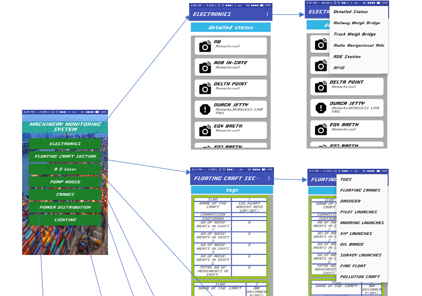
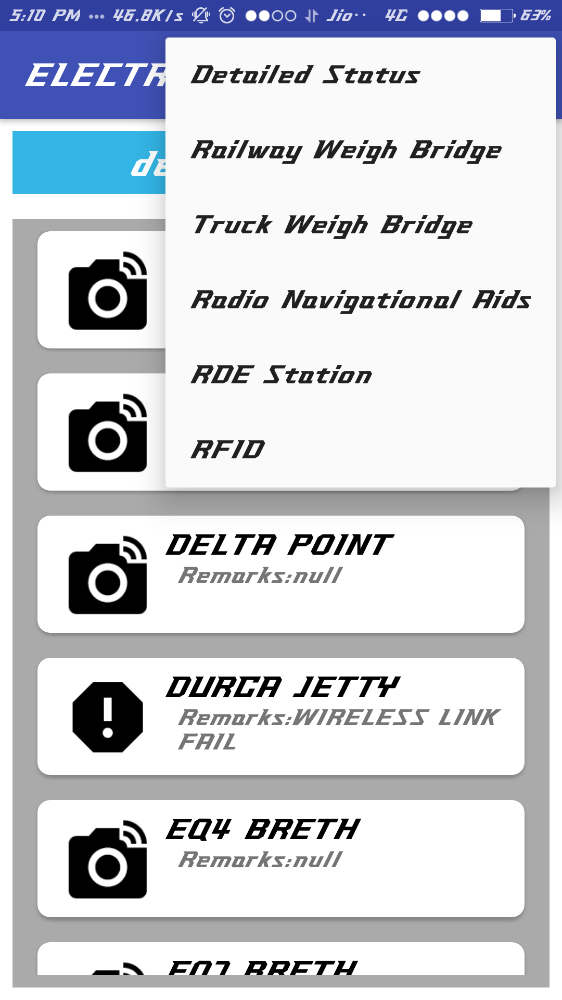
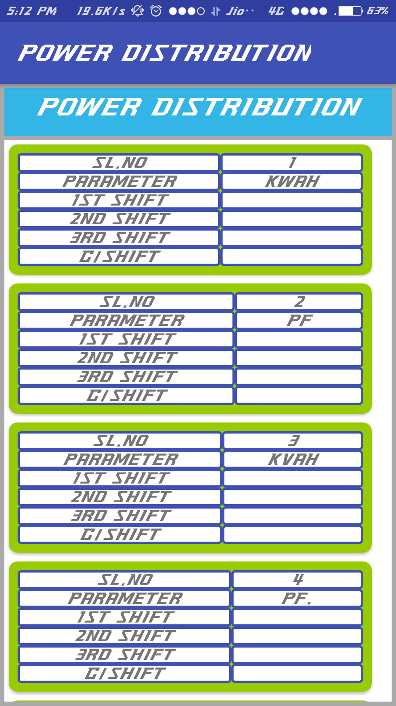

# VizagPortTrust
ANDROID APP DONE DURING SUMMER INTERNSHIP IN MY 3-2

This App displays the machinery status in vishakapatnam port on real time data either input by POs in shift through this app  or through website by admin on request.

I added the login functionality ,it allows all employees to login but only a selected few to edit the content for example: shift POs.
This functionality reduces visiting database through Myphpadmin for editing whenever their is a change to be updated.

for more info:
check documentation and ppt available in screenshots folder.

## class diagram

## layout tree

## cameras layout 

## Power distribution layout

